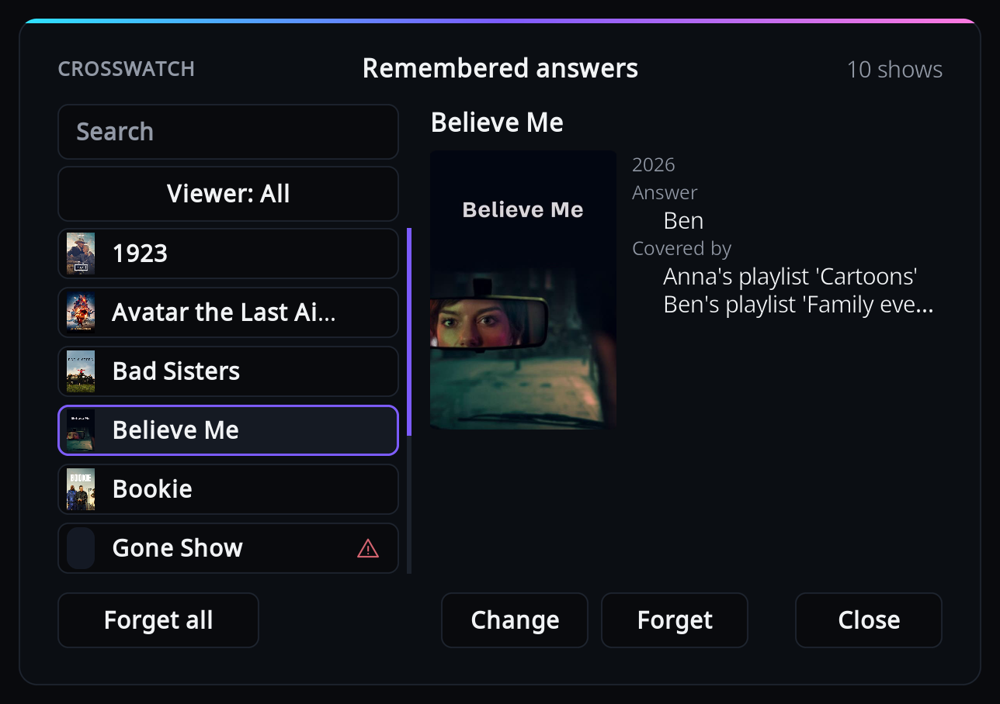
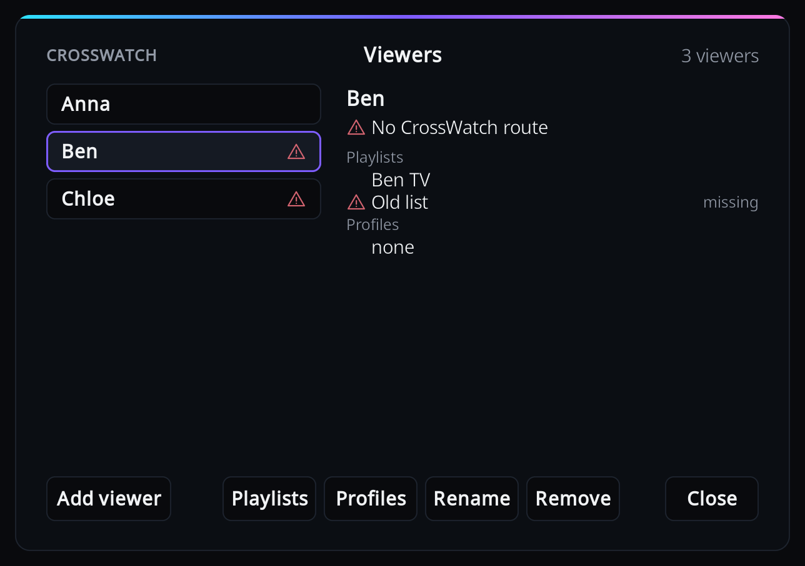

# CrossWatch for Kodi

A Kodi service add-on that reports what you watch to your own
[CrossWatch](https://github.com/cenodude/CrossWatch), including **who** in the household
watched it. CrossWatch then syncs each person's watch history to their own Trakt, Simkl,
Plex, Emby or Jellyfin account, so a household sharing one Kodi profile does not end up
sharing one watch history. See the [CrossWatch wiki](https://wiki.crosswatch.app) for how
CrossWatch itself is set up.

> ## Beta
>
> This is a beta (1.0.0~beta1), installable from a GitHub release; see the Install section
> below. It needs CrossWatch v0.13.3 or later, where Kodi add-on support is marked
> experimental.
>
> It has been tested on Kodi 21.3 (Omega) against CrossWatch v0.13.3 and the development
> builds before it, including pairing, Link, routing playback by viewer, and replay after an
> outage. Not yet tested: Kodi on Android, and
> skins other than Estuary.

## Requirements

- Kodi 21 (Omega). Later versions have not been tested; do not assume they work.
- CrossWatch v0.13.3 or later, the first release with Kodi add-on support.
- Kodi able to reach CrossWatch over the network, for example both on the same home
  network. CrossWatch does not need to reach Kodi, except for Link.
- For an `https://` address: a certificate from a public certificate authority, such as
  Let's Encrypt through a reverse proxy. Self-signed certificates are not supported. Type the
  address with `https://`; without a scheme, `http://` is assumed.

Kodi's web server and JSON-RPC interface are not needed. The only thing that uses them is
the optional Link shortcut, described below.

## Install

### Beta

This add-on has not reached the official Kodi add-on repository yet. Install the beta from a
[GitHub release](https://github.com/crosswatch-app/kodi-addon/releases) instead:

1. Download `service.crosswatch-v1.0.0-beta1.zip` from that release's assets.
2. In Kodi, turn on Settings > System > Add-ons > "Unknown sources". Kodi warns that add-ons
   get access to personal data; choose Yes to continue.
3. Go to Add-ons > "Install from zip file" and pick the zip.
4. Follow the [Quick start](#quick-start) below.

A zip install does not update itself: to update, install the next zip over it.

### Later

Once the beta has run for a while, this add-on will come to the official Kodi add-on
repository and to the author's own repository, with automatic updates.

## Quick start

1. In CrossWatch, open the Kodi entry and choose to add this device with the add-on option
   (CrossWatch also offers a JSON-RPC option; that is for Link, covered below). CrossWatch
   gives you a pairing code. CrossWatch's wiki shows its screens:
   [Kodi add-on](https://wiki.crosswatch.app/crosswatch/settings/connections/media-clients/kodi/kodi-add-on).
2. In Kodi, go to Add-ons > My add-ons > Services > CrossWatch > Configure, open the
   CrossWatch category, and select "Pair with CrossWatch". Enter the address first, then
   the code.
3. In CrossWatch, set up a Kodi watcher route for each person in the household. In each
   route's "Username whitelist" (the names that route accepts), enter that person's name.
   Once the add-on is paired and has viewers, the route's "Find users" button also lists
   the viewer names it reported.
4. In the add-on settings, Viewers category, select "Configure viewers and playlists" and
   add one viewer per person. Each viewer's name must match exactly the username you put in
   that person's route. Give each viewer one or more smart playlists, or one or more Kodi
   profiles. A one-person household only needs the one viewer, with no playlists or
   profiles.

Names have to match because CrossWatch sends a playback to the route whose username whitelist
contains the viewer's name. A viewer named differently from every whitelist is still sent,
but only a route with an empty whitelist accepts it.

## Connecting to CrossWatch

### Pairing

This is the normal way to connect. In the add-on settings, CrossWatch category, select "Pair
with CrossWatch".

1. In CrossWatch, open the Kodi instance you want this device to use and ask it for a pairing
   code.
2. Back in the add-on, type the CrossWatch address: `192.168.1.10:8787` is enough, `http://` is
   assumed if you leave it off, and a trailing slash or a full webhook URL both work too.

   

3. Type the code it gave you: 6 characters, capitals and digits, valid for 10 minutes and good
   for one use. Case and spaces do not matter, so `ab 23 cd` and `AB23CD` are the same.

   

On success you get a notification naming the CrossWatch instance, and the Status line
(read-only, just under the Pair button) reads "Paired with `<instance>` at `<address>`".

If it does not succeed, nothing is changed: the previous connection, if any, stays in place.
What you see depends on what went wrong:

- A wrong or expired code: "Code wrong or expired. Get a new code in CrossWatch."
- Too many tries: "Too many tries. Wait a minute and try again."
- CrossWatch cannot be reached at that address: "Can't reach CrossWatch at `<address>`."
- Some other failure on CrossWatch's side: "Pairing failed: CrossWatch answered HTTP `<code>`."
- The Kodi add-on is switched off in CrossWatch: "The Kodi add-on is switched off in
  CrossWatch. Turn it on there, then pair again."
- An HTTPS certificate the add-on does not trust: "The certificate of `<address>` was not
  accepted. HTTPS needs a certificate from a public certificate authority; a self-signed one
  does not work."
- An address that cannot be used, such as one starting with `ftp://`: "Not a CrossWatch
  address: `<address>`"

Each of these appears in a dialog on screen.

Pressing Pair or Unpair closes the settings screen first, saving anything else you changed
there. The add-on switches to the new connection as soon as you finish, no Kodi restart
needed, and sends a heartbeat right away, so CrossWatch sees it within seconds.

### Link (shortcut)

Link only works when CrossWatch already controls this Kodi through Kodi's web interface
(JSON-RPC), which is off by default. Most households will not have this on and should pair
instead.

When it applies, CrossWatch starts it: the TV shows "Link this Kodi to CrossWatch at
`<address>`?" with No already selected.

Choosing Yes connects, using a one-time code CrossWatch sent along, so a Link that fails
shows the same messages as pairing above. Choosing No, or not answering within 60 seconds,
changes nothing.

### The Status line

This line is read-only; it only ever reports what the add-on last did. It reads one of:

- "Paired with `<instance>` at `<address>`", after pairing or a Link.
- "Not paired", when nothing is connected.

### Unpair

The "Unpair" button appears only while the add-on is connected. It asks for confirmation, then
stops reporting. Any completed watches already kept on disk for delivery during an outage are
not deleted: they are still sent if you pair again with the same CrossWatch instance. Moving to
a different CrossWatch does not need Unpair first, just pair again.

### Manual setup (advanced)

If you would rather not pair, "Webhook URL" and "Webhook token" are available at the Advanced
settings level (use the settings level button on Kodi's settings screen to change the level).

CrossWatch's instance page also offers a manual option: a full URL with `?token=` in it. You
can paste that whole URL into "Webhook URL"; the add-on takes the token out of it and moves it
into "Webhook token" for you. Whichever way the token gets there, it is only ever sent in a
request header, never in the URL.

## Who watched

The add-on works out who was watching, first match wins:

### Smart playlists

A show (for an episode) or a film is credited to every viewer whose playlist contains it.
Playlists are video smart playlists from Kodi's playlists folder, of shows or of films;
playlists of episodes or music videos are not used. The playlist picker only offers playlists
of shows or films. If a viewer already had a playlist of another type, it is not listed in
the picker, and it stays in their list until you press Done, which removes it from that
viewer (Cancel or Back leaves it). Until it is removed, the Viewers window still shows that
playlist tagged "unusable". It never credits anyone and is simply ignored: the viewer's other
playlists still count. Playlists of the wrong type are never offered to anyone.

- Works well: a fixed list of shows, or rules on genre, tag or similar show attributes.
- Avoid playlists whose membership follows from playback itself, such as "Continue Watching"
  or "In Progress" smart playlists (rules on in-progress, play count or last played). Playing
  a show adds it to such a playlist, so the next episode is attributed to whoever owns it,
  even if someone else watched it.

If a viewer's playlist cannot be read (it was deleted or renamed), the viewer list shows it
as missing, Kodi shows a notification, and all of that viewer's playlists stop counting until
it is fixed: that viewer falls through to profile matching and the end-of-playback question.

### Kodi profile

If the active Kodi profile is one of a viewer's profiles (the name match ignores case), that
viewer is credited. Profiles are picked from Kodi's own list under the viewer's "Profiles"
button (see "Viewer list" below).

### The question at the end

When neither of the above answered, Kodi asks who watched when playback stops, never at the
start, so it never delays playback.

The question is a CrossWatch window, not the skin's standard dialog. It shows the title of the
show or film with its poster (if there is none, a placeholder in the CrossWatch colours reading
"No poster"), plus "Season N, episode M" for an episode or the year for a film. Below that is
an "Everyone" row, then each configured viewer; focus starts on Everyone.

- OK on a viewer ticks or unticks that viewer. You can tick more than one.
- OK on Everyone ticks every viewer, or clears them all when all are already ticked.
- Done, below the list, sends the watch with the ticked viewers.
- Skip or Back sends the watch with no viewer. Nothing is remembered, so the question comes
  back next time. Done with nobody ticked does the same.

A countdown in the corner ("Closes in N s") runs from 120 seconds; at zero the window closes
as if you had skipped. It also closes straight away, as if skipped, when playback starts
again while it is open.

It is not asked:

- with fewer than two viewers configured.
- for a film, when "Ask who watched a film" is off.
- when playback stopped within Kodi's "ignore at start" time (180 seconds unless changed in
  Kodi's advanced settings).
- while another dialog is already open.
- when the next item starts playing right away (binge or autoplay); the one that just ended
  is then sent with no viewer.

For a show, the answer is remembered and reused for later episodes, including from the start
of playback. For a film, nothing is remembered.

### Nobody resolved

If no viewer is resolved by any of the above, the event is sent with no viewers. CrossWatch
treats that as an unknown viewer. The exception is a household with exactly one viewer
configured: that viewer is credited instead (see "One person in the household" below).

### One person in the household

If you are the only person who watches, add yourself as the one viewer under "Configure viewers
and playlists". The viewer's name must match the username in your CrossWatch route's whitelist.
You do not need any playlists or Kodi profiles: with exactly one viewer configured, every
playback (start, pause, progress and stop) is credited to you. The end-of-playback question is
never asked when there is only one viewer. With two or more viewers nothing changes.

The event carries your name, so a route with your name in its username whitelist receives it,
and so does a route with an empty whitelist.

Configuring no viewers at all also still works, with a CrossWatch route that has an empty
username whitelist. The events then carry no viewer.

### Remembered answers

The add-on settings have a Remembered answers entry under Viewers, next to Configure
viewers and playlists. It opens one CrossWatch window titled "Remembered answers", listing
every show with a remembered answer. The top line has "CROSSWATCH" on the left, the title in
the middle and a count on the right that shows how many ("12 shows", or "3 of 12" when a
search or viewer narrows the list).

On the left are the Search box, the Viewer button below it, and then the shows, each with a
small poster and its title. A warning icon on a show means its answer needs a look: the show
is not in your library any more, or the answer is not stable (see below). To search, press OK
on the box, type with Kodi's keyboard and confirm. It matches show titles and viewer names.
The Viewer button cycles with OK through All, each configured viewer, and "will ask again"
(shows nobody is remembered for). Search and viewer combine. When nothing is listed the
window says "Nothing matches".

The right side shows the highlighted show, so moving up and down the list changes it. It has
the show's title, its poster (or "No poster"), the year (when known), and then:

- "Answer": the viewers the answer is for, or "will ask again" when none of its viewers is
  configured any more.
- "Covered by": shown when a playlist decides this show, with one line per playlist, such as
  "Anna's playlist 'Cartoons'". The answer is kept, and used again if the show leaves the
  playlist.
- "Not in library": shown with "gone from Kodi's library" when the show is no longer in your
  Kodi library.
- "Not stable": shown when the answer was stored against Kodi's database id and that id can no
  longer be trusted. It says either "now points at <other show>" (the id now holds a different
  show) or "no title stored to check it" (the id cannot be checked).

When there are more lines than fit, the last one says "and N more".

Change and Forget are together in the bottom row, on the right, just left of Close:

- Change opens the who-watched window with the current answer ticked and no countdown. Done
  saves the new answer. Done with nobody ticked forgets the answer, so the show is asked about
  again after its next episode. Skip or Back leaves the answer unchanged. Change is not shown
  for a "Not stable" show, which can only be forgotten.
- Forget asks "Forget who watched this show? It will be asked again." first, with No
  preselected. Yes forgets the answer, so the show is asked about again after its next
  episode.

OK on a show moves to Change (or to Forget for a "Not stable" show).

At the bottom left of that row, "Forget all" becomes "Forget N shown" while a search or viewer
narrows the list, and is hidden when nothing is listed. It forgets exactly the shows listed,
after a Yes/No confirmation (No is preselected). Close, in the bottom-right corner, leaves the
screen; so does Back. For a "Not stable" show only Forget is shown there.

After each change the window comes back with the same search and viewer, on the same show;
after a forget, on the show that took its place. When nothing is left the screen closes with a
short notice. Changes apply from the next playback, no restart needed.

Playlist membership is checked first, so it overrides a remembered answer to the prompt. The
Remembered answers screen shows such a show as "Covered by" the playlist: its answer is kept,
and applies again if the show leaves the playlist. That makes the choice of playlist matter:
it should describe what that person watches, not what they just happened to play.

### Viewer list

"Configure viewers and playlists" opens one CrossWatch window titled "Viewers". The top line
has "CROSSWATCH" on the left, the title in the middle and a count on the right ("3 viewers").
The viewers are listed by name on the left. A warning icon on a row means something about that
viewer needs fixing: a missing or unusable playlist, a profile Kodi no longer has, or no
CrossWatch route.

The right side shows the highlighted viewer, so moving up and down the list changes it. It
has the viewer's name, directly below it the CrossWatch line (described below), then
"Playlists" with each playlist on its own line, then "Profiles" with each profile (a section
reads "none" when it is empty). A playlist that was deleted or renamed, and a profile Kodi no
longer has, are tagged "missing" with a warning icon; a profile is only tagged when Kodi's
profiles could be read. A playlist that is not a TV show or film
playlist is tagged "unusable". When there are more lines than fit, the last one says "and N
more": the "Playlists" and "Profiles" buttons list them all. That line carries the warning
icon when one of the lines it hides needs fixing.

The CrossWatch line works like this. A check icon and "CrossWatch route" mean a CrossWatch
route accepts the viewer's name; a warning icon and "No CrossWatch route" mean none does.
CrossWatch reports its routes for this Kodi, and the names each route accepts, when it answers
the add-on's regular check-in (every five minutes, and straight away when the viewer names
change). The line only appears once CrossWatch has answered with its routes for the current
pairing, and only for names it was asked about: when the add-on is not paired, or CrossWatch
has never sent its routes, nothing is shown, and a viewer just added or renamed shows nothing
until CrossWatch's next answer.

The bottom row has "Add viewer" on the left, the buttons "Playlists", "Profiles", "Rename" and
"Remove" together in the middle, and "Close" on the right. The four in the middle act on the
highlighted viewer. OK on a viewer moves to "Playlists". Back closes the window. After each
action the window comes back on the same viewer: after "Rename" on the new name, after "Add
viewer" on the new viewer, and after "Remove" on the viewer that took its place (the one before
it, when the last viewer was removed). With no viewers configured yet, the screen starts
straight at "Add viewer". If every viewer is removed, the window shows "No viewers yet" with
only "Add viewer" and "Close".

Every change is saved straight away, so there is no need to close the screen, and it applies
from the next playback.

"Add viewer" asks for the viewer's name ("Viewer name, as CrossWatch routes it"), then which
playlists are theirs (the playlist window, described below), then the Viewers window comes
back with the new viewer highlighted.

"Profiles" opens a window titled "Profiles for <name>" that lists Kodi's profiles. The list
comes from Kodi itself, so nothing is typed. Press OK on a profile to tick or untick it; the
viewer's current profiles start ticked. "Done" keeps the ticked profiles. "Cancel" or Back
leaves them as they were. A profile the viewer has that Kodi no longer has is listed last,
ticked, tagged "missing". A profile that another viewer already has shows "Also <names>". If
Kodi's profiles cannot be read, a message says so ("Kodi's profiles could not be read. Try
again in a moment.") and nothing changes.

"Rename" opens Kodi's keyboard with the current name filled in. A name that another viewer
already has is refused and nothing changes; changing only the upper and lower case of the
viewer's own name is allowed. The viewer's remembered answers move to the new name. Change the
username whitelist of the CrossWatch route to the new name too, or that route stops receiving
this viewer's playback.

"Remove" first asks in a CrossWatch window titled "Remove <name>?": "Remembered answers lose
this name. A show nobody else is remembered for is asked again." No is preselected. Yes
removes the viewer and takes their name out of every remembered answer. An answer that is left
with nobody is forgotten, so that show is asked about again at the end of its next episode.

"Playlists", and the playlist step of Add viewer, open a CrossWatch window titled "Playlists
for <viewer name>". It lists Kodi's smart playlists of TV shows or films. Press OK on a
playlist to tick or untick it; the viewer's current playlists start ticked. "Done" keeps the
ticked playlists. "Cancel" or Back leaves the viewer's playlists exactly as they were.

A search box at the top narrows the list by playlist name: press OK on it, type with Kodi's
keyboard and confirm. A ticked playlist the search hides stays ticked and is kept when you
press Done. The count on the top line, on the right, shows how many playlists are listed ("7
playlists", or "1 of 7" while searching).

A playlist that another viewer already has shows "Also <names>" next to it (for example "Also
Ben, Chloe"). Giving a playlist to two viewers credits both of them for everything in it.

A playlist the viewer has that was deleted or renamed is listed at the end, ticked, tagged
"missing". Untick it and press Done to remove it from that viewer; leave it ticked and it is
kept, so it counts again if the playlist comes back. A playlist the viewer has that is not a
TV show or film playlist is not listed (see "Smart playlists" above). Playlists of the wrong
type are never offered to anyone.

When Kodi has no smart playlists of TV shows or films at all, a message says so ("Kodi has
no smart playlists of TV shows or films yet. Make one under Videos, Playlists, then come
back here.") and no list opens. The viewer's playlists stay as they were.

## Settings reference

### CrossWatch

| Setting | Default | What it does |
|---|---|---|
| Pair with CrossWatch | | Starts pairing: enter the CrossWatch address, then the pairing code. |
| Status | (read-only) | Shows "Paired with `<instance>` at `<address>`" or "Not paired". |
| Unpair | | Disconnects this Kodi from CrossWatch. Only shown while paired. |
| Webhook URL | (blank) | Advanced level. Manual webhook address, instead of pairing. |
| Webhook token | (blank) | Advanced level. Manual webhook token, instead of pairing. |
| Device id (blank to generate) | (blank) | Advanced level. Leave blank to have the add-on generate one. |

### Viewers

| Setting | Default | What it does |
|---|---|---|
| Configure viewers and playlists | | Add, edit or remove viewers and their playlists or Kodi profiles. |
| Remembered answers | | View, change or forget who-watched answers remembered per show. |
| Ask who watched a film | on | Whether the who-watched question is also asked after a film. |
| Skip PlexKodiConnect playback | on | PlexKodiConnect playback is not reported, so a household also running CrossWatch's own Plex watcher does not get the same watch counted twice. Turn off to report PlexKodiConnect playback instead, labelled as such. This setting has not been tested, because PlexKodiConnect is not available on the test machine. |

### Advanced

| Setting | Default | Range | What it does |
|---|---|---|---|
| Progress report interval (seconds) | 60 | 30 to 600, steps of 30 | Standard level. How often a progress event is sent while something is playing, and again after a seek. |
| Playlist refresh interval (minutes) | 60 | 5 to 720 | Advanced level. How often playlist membership is re-read. Also re-read after a library scan or clean, and after a settings change. |
| Enable debug logging (records viewing history to disk) | off | | Writes detailed lines to the add-on's own log, including titles and viewer names. Leave off unless troubleshooting. |

## Troubleshooting

**Nothing arrives in CrossWatch**

- Check the Status line: if it says "Not paired", pair again.
- Check CrossWatch is reachable at the paired address.
- If the add-on is switched off in CrossWatch, pairing itself will say so.
- PlexKodiConnect playback is skipped by default; see "Skip PlexKodiConnect playback" above.
- Using `https://`: the certificate must come from a public certificate authority. A
  certificate problem shows its own message when pairing; after pairing, the add-on's log
  shows `CERTIFICATE_VERIFY_FAILED` on each failed send.

**Playback arrives under nobody, or under the wrong person**

- Check the viewer's name matches the name in that person's route "Username whitelist"
  exactly.
- Check the viewer has a playlist or Kodi profile configured.
- Check whether a playback-driven playlist (such as "Continue Watching") is attributing it to
  the wrong person; see "Smart playlists" above.
- Check the Remembered answers screen for a show shown as "Covered by" a playlist.

**The who-watched question never appears**

See "The question at the end" above for the cases where it is not asked.

**A playlist shows as missing**

The playlist was renamed or deleted. Edit that viewer's playlists and point it at a playlist
that still exists.

**A viewer shows "No CrossWatch route"**

No CrossWatch route accepts that viewer's name, so their playback has nowhere to go. Check, in
order:

1. The name in the route's username whitelist against the viewer's name. They must be the
   same name; CrossWatch ignores upper and lower case and punctuation when comparing.
2. That the person has a route in CrossWatch at all. If not, create one with their name in its
   username whitelist.
3. Whether the viewer was just renamed. The whitelist may still have the old name: change it
   to the new one.

A route with an empty whitelist accepts every viewer, unless a CrossWatch profile is set on
that route. The line can take a moment to change: it updates when CrossWatch answers the add-on's
next check-in (every five minutes, and straight away when the viewer names change).

**A playlist shows as unusable**

The playlist is not a TV show or film playlist, so it can never credit anyone. It is not listed
in the picker, so there is nothing to untick: open that viewer's "Playlists" and press Done to
remove it, or change the playlist's type in Kodi to shows or films. The viewer's other
playlists keep working in the meantime.

If Kodi has no TV show or film smart playlists at all, the viewer's "Playlists" shows the "Kodi
has no smart playlists of TV shows or films yet" message instead of the list, so Done is not
available. In that case, make a TV show or film smart playlist ("Playlists" then opens, and
Done removes the unusable one), change the unusable playlist's type in Kodi to shows or films,
or remove the viewer and add them again.

### Logs

The add-on writes its own log under
`userdata/addon_data/service.crosswatch/logs/crosswatch.log`
(see the [Kodi wiki](https://kodi.wiki/view/Userdata) for where `userdata` is on your system).
Turn on "Enable debug logging" for more detail.

The log never contains the webhook token or a pairing code. Normal lines carry counts, not
names. Debug lines carry titles and viewer names.

## What the add-on sends

Everything goes only to your own CrossWatch, which then passes it on to whatever services you
have set up there:

- Playback events (start, pause, resume, progress, stop) and a heartbeat every five minutes.
- The device name, a generated device id and the add-on's version.
- Viewer names, and how they were found (playlist, profile or the question).
- Title, year, season and episode; the ids Kodi's library has for it (such as TMDb, TVDb,
  IMDb); playback position and progress; the file path; and, for PlexKodiConnect playback,
  the Plex rating key.

The webhook token travels only in a request header, never in a URL. Nothing is sent anywhere
other than your own CrossWatch.

## When CrossWatch cannot be reached

Every playback event (start, pause, resume, progress, stop) and the periodic heartbeat is
sent only while it is still true. The add-on keeps trying for two minutes from the moment
the event happened, then gives up on it. It never sends one late, because an old position
could overwrite a newer resume point.

The one exception is a stop that completes a watch, meaning Kodi played the item to the end,
or played to at least its watched threshold (90 percent by default, the
`playcountminimumpercent` advanced setting, the same rule Kodi itself uses).

- That stop is written to `outbox.json` in the add-on's data folder
  (`userdata/addon_data/service.crosswatch/`) before the first send is even attempted. It
  survives CrossWatch being down and Kodi being restarted or switched off.
- It is retried every five minutes while Kodi runs, and straight away when Kodi starts.
- When it is finally delivered, it carries its original time and is marked as replayed,
  so CrossWatch sees the same event arriving late, not a new one. Plex, Emby and
  Jellyfin record the watch at the time it happened; trackers such as Trakt and Simkl,
  and CrossWatch's own history, record it at the time it arrives, so a watch delivered
  late shows up late there. It is removed from the file once CrossWatch accepts it.
- It is dropped, with a warning in the log, if CrossWatch refuses it, if it has waited more
  than seven days, if more than 200 stops are already waiting (oldest dropped first), or if
  the add-on has since been paired with a different CrossWatch instance (a new token), so a
  stored stop is never sent to a different CrossWatch. A new address for the same instance
  keeps it.

Kodi still marks the item watched in its own library either way. But only this add-on knows
who watched it, so a stop that is ultimately dropped loses the viewer attribution for that
watch, not the watched state itself.

Nothing is stored when no webhook is configured. No other event is written to disk: progress,
pause and heartbeat events are held only in memory for their two-minute window.

## Getting help

Open an issue at [crosswatch-app/kodi-addon](https://github.com/crosswatch-app/kodi-addon/issues).
A Kodi forum thread will follow with the first release.

Developers: the payload contract is [docs/contract.md](docs/contract.md).

## Licence

GPL-2.0-only. See [LICENSE](LICENSE).

The status icons are Material Symbols by Google, under the Apache License 2.0
([resources/licences/Apache-2.0.txt](resources/licences/Apache-2.0.txt)).
